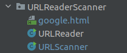
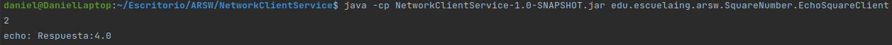
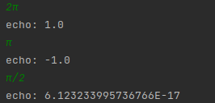
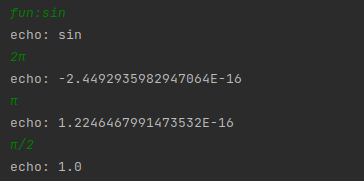
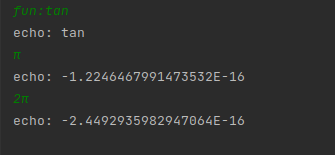
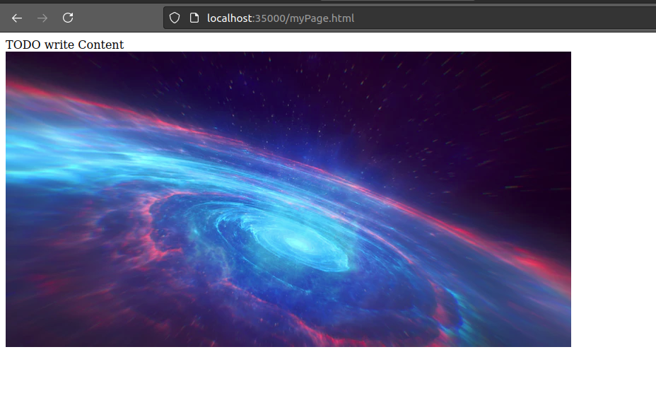
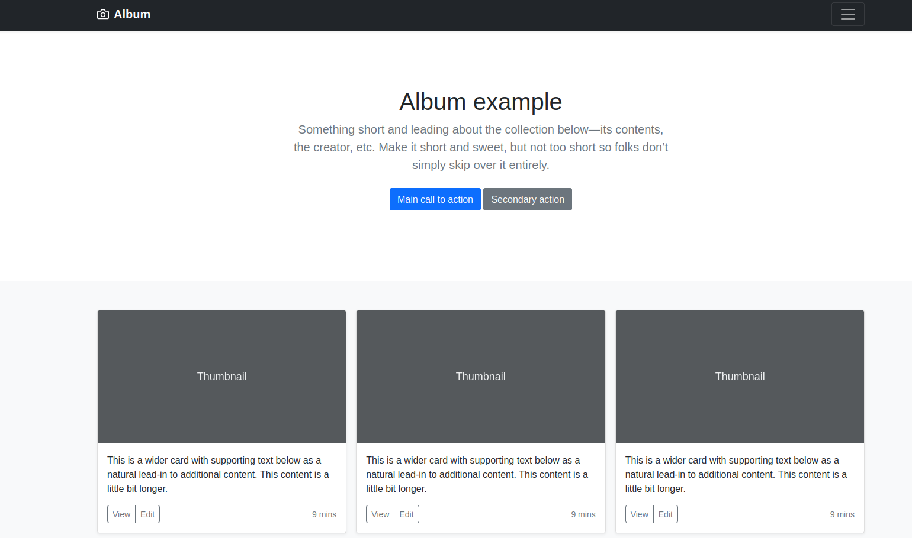
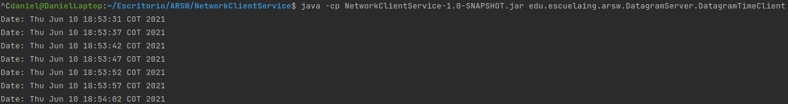
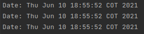
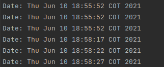

# NetworkClientService
Taller en donde se realizan distintos ejercicios de networking como manejo de sockets, servidor web HTTP y conexión cliente servidor tanto en Datagramas como envío y recepción de mensajes.
## Instrucciones de Uso
### Prerrequisitos
* git version 2.25.1
* Apache Maven versión: 4.0.0
* java versión: "1.8.0"
### Ejecución
Para poder usar el proyecto lo primero que se debe realizar es clonar el proyecto utilizando el siguiente comando desde una terminal:
```
git clone https://github.com/Desarik98/NetworkClientService.git
```
Luego debe redirigirse por medio de la terminal al directorio en donde se clonó el proyecto la cual contendrá el archivo pom.xml.
Una vez ubicado en este directorio se debe compilar el programa, para esto, utilice el siguiente comando:
```
mvn package
```
#### Ejercicio 1: URLScanner
Utilice el siguiente comando para la ejecución del ejercicio:
```
java -cp java -cp NetworkClientService-1.0-SNAPSHOT.jar edu.escuelaing.arsw.URLReaderScanner.URLScanner
```
Donde se mostrará el siguiente resultado:
```
Protocolo: http
authority: ldbn.escuelaing.edu.co:80
host: ldbn.escuelaing.edu.co
port: 80
path: /publicaciones.pdf=val=45&r=78
quey: null
file: /publicaciones.pdf=val=45&r=78
ref: publicaciones
```
Este ejercicio nos retorna toda la información de un objeto URL. En este caso, de la URL http://ldbn.escuelaing.edu.co:80/publicaciones.pdf=val=45&r=78#publicaciones
#### Ejercicio 2: URLReader
Esta aplicación pregunta a una dirección URL al usuario, lee y almacena los datos de esta URL en un documento HTML, el formato de la URL debe incluir el protocolo.

Utilice el siguiente comando para la ejecución del ejercicio:
```
java -cp java -cp NetworkClientService-1.0-SNAPSHOT.jar edu.escuelaing.arsw.URLReaderScanner.URLReader URL
```
Ejemplo del comando para la ejecución del ejercicio
```
java -cp java -cp NetworkClientService-1.0-SNAPSHOT.jar edu.escuelaing.arsw.URLReaderScanner.URLReader https://www.google.com
```


#### Ejercicio 3: SquareNumber
Esta aplicación nos retornará el cuadrado de un número dado por el Cliente, para esto se hace el uso de sockets, que se utilizan para realizar la comunicación con el Servidor quien devolverá el cuadrado de este número.

Utilice los siguientes comandos en diferentes terminales para la ejecución del ejercicio:
(Primero el Servidor, luego el Cliente)
```
java -cp NetworkClientService-1.0-SNAPSHOT.jar edu.escuelaing.arsw.SquareNumber.EchoSquareServer
java -cp NetworkClientService-1.0-SNAPSHOT.jar edu.escuelaing.arsw.SquareNumber.EchoSquareClient
```
A continuación en la terminal en donde se ejecuta el Cliente, digitará cualquier número, y al darle Enter le devolverá un mensaje con el cuadrado correspondiente.



#### Ejercicio 4: TrigonometricOperations
Esta aplicación nos retornara el valor de una función trigonométrica especificada dado un número digitado por el usuario, por defecto calculara el coseno del número dado. En caso de querer cambiar de función se deberá escribir la sentencia fun: funcionTrigonometrica y después el cliente podrá digitar números para ver su resultado.

Utilice los siguientes comandos en diferentes terminales para la ejecución del ejercicio:
(Primero el Servidor, luego el Cliente)
```
java -cp NetworkClientService-1.0-SNAPSHOT.jar edu.escuelaing.arsw.TrigonometricOperations.EchoTrigonometricServer
java -cp NetworkClientService-1.0-SNAPSHOT.jar edu.escuelaing.arsw.TrigonometricOperations.EchoTrigonometricClient
```
A continuación en la terminal en donde se ejecuta el Cliente, digitará cualquier número, y al darle Enter le devolverá el coseno de un número por defecto, para utilizar el número PI se deberá utilizar el símbolo **π**.



En caso de querer cambiar de función deberá digitar:
* fun:sin para función seno
* fun:cos para función coseno
* fun:tan para función tangente y después digitar los números a operar
  
  
  
  
#### Ejercicio 5: HTTPServer
Implementación de un servidor web que soporta solicitudes no concurrentes el cual retorna todos los archivos solicitados, incluyendo páginas HTML e imágenes.

Utilice el siguiente comando para ejecutar el servidor web:
```
java -cp NetworkClientService-1.0-SNAPSHOT.jar edu.escuelaing.arsw.HttpServer.HttpServer
```
A continuación diríjase a un browser y digite las siguientes URL
```
http://localhost:35000/myPage.html
http://localhost:35000/album/index.html
```
La primera URL mostrará una página web básica en donde se verá el retorno de imágenes.



La segunda URL mostrará una página web con Bootstrap en donde se verá el retorno de html, js y css.



#### Ejercicio 6: DatagramServer
Implementación de un Servidor y un Cliente que se envían entre sí datagramas mediante el protocolo UDP, el cual mientras el servidor este encendido el Cliente recibirá cada 5 segundos la hora actual del servidor, en dado que el servidor se apague el cliente seguirá recibiendo la última hora recibida por el servidor y al volver a prenderse el cliente volverá a obtener la hora actual.

Utilice los siguientes comandos en diferentes terminales para la ejecución del ejercicio:
(Primero el Servidor, luego el Cliente)
```
java -cp NetworkClientService-1.0-SNAPSHOT.jar edu.escuelaing.arsw.DatagramServer.DatagramTimeServer
java -cp NetworkClientService-1.0-SNAPSHOT.jar edu.escuelaing.arsw.DatagramServer.DatagramTimeClient
```
A continuación el Cliente estará recibiendo la hora actual del servidor cada 5 segundos:



Si el Server se detiene el Cliente seguirá recibiendo la última hora dada por el Server:



Si el Server se reanuda el Cliente volverá a obtener la hora actual del Server actualizada:



## Autor
* Daniel Alejandro Mejía Rojas - Fecha: 10/06/2021
## Licencia
This project is licensed under the CC0 1.0 Universal Creative Commons License - see the LICENSE.md file for details
